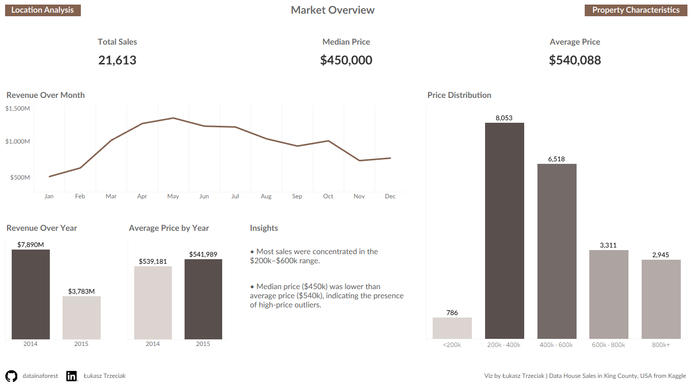
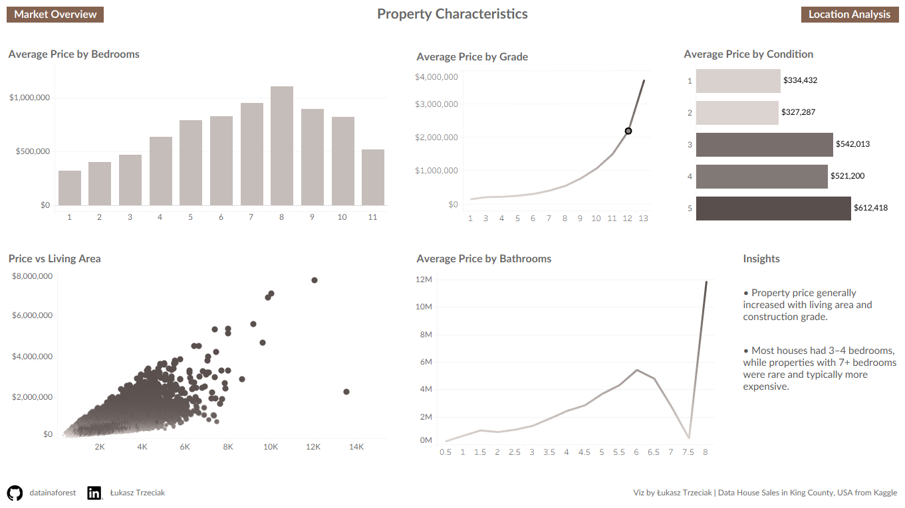
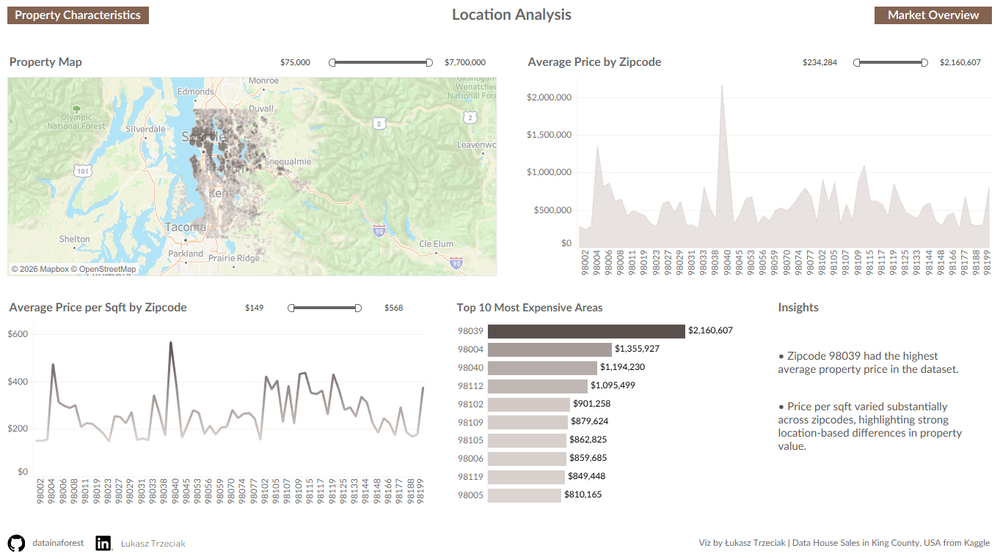

# 🏠 House Sales Analysis in King County, USA

This project presents an end-to-end data analysis of residential property sales in **King County, Washington, USA** using **PostgreSQL (DBeaver)** for data cleaning and exploratory data analysis, and **Tableau** for interactive dashboard design.

The dataset contains information about house sales, property characteristics, prices, location, and renovation details. The goal of this project was to identify pricing patterns, analyze relationships between property features and sale prices, and compare property values across locations.

---

## 📌 Project Objectives

The main goals of this project were to:

- clean and validate raw housing data
- perform exploratory data analysis in SQL
- identify key drivers of house prices
- analyze pricing trends over time
- compare property values by location
- build a professional multi-page dashboard in Tableau

---

## 🛠️ Tools Used

- **PostgreSQL** – database used for storing and querying the dataset
- **DBeaver** – SQL client used to write and execute SQL queries
- **Tableau** – data visualization and dashboard creation

---

## 🗂️ Dataset

The dataset includes house sales in **King County, USA** for the years **2014–2015**.

Each row represents one property sale and includes fields such as:

- `id`
- `date`
- `price`
- `bedrooms`
- `bathrooms`
- `sqft_living`
- `sqft_lot`
- `floors`
- `waterfront`
- `view`
- `condition`
- `grade`
- `sqft_above`
- `sqft_basement`
- `yr_built`
- `yr_renovated`
- `zipcode`
- `lat`
- `long`
- `sqft_living15`
- `sqft_lot15`

---

## 🧹 Data Cleaning

Several data quality checks were performed before analysis:

- checked duplicate records by `id` and `date`
- verified missing values and unusual values
- identified houses sold multiple times
- replaced unrealistic values such as:
  - `bedrooms = 0` → `NULL`
  - `bathrooms = 0` → `NULL`
  - extreme outlier `bedrooms = 33` → `NULL`
- validated price, size, and year ranges
- reviewed renovation information

---

## 📊 Exploratory Data Analysis

The analysis was divided into three main sections:

### 1. Market Overview
- total sales
- average price
- median price
- revenue over month
- revenue over year
- price distribution
- average price by year

### 2. Property Characteristics
- average price by bedrooms
- average price by bathrooms
- price vs living area
- average price by grade
- average price by condition

### 3. Location Analysis
- average price by zipcode
- average price per sqft by zipcode
- top 10 most expensive areas
- property map based on latitude and longitude

---

## 🔍 Key Insights

### Market Overview
- Most property sales were concentrated in the **$200k–$600k** range.
- The **median price ($450k)** was lower than the **average price ($540k)**, suggesting the presence of high-value outliers.

### Property Characteristics
- Property prices generally increased with **living area** and **construction grade**.
- Most houses had **3–4 bedrooms**, while homes with **7+ bedrooms** were rare and typically more expensive.

### Location Analysis
- **Zipcode 98039** had the highest average property price in the dataset.
- Price per sqft varied substantially across zipcodes, highlighting strong **location-driven differences** in property values.

---

## 🔗 Live Dashboard

You can explore the interactive Tableau dashboard here:  
[House Sales Analysis in King County, USA](https://public.tableau.com/app/profile/datainaforest/viz/housesales_17739236507530/LocationAnalysis)

---

## 🖼️ Dashboard Preview

### Market Overview


### Property Characteristics


### Location Analysis


---

## 📂 Repository Structure

```bash
House-Sales-Analysis/
│
├── README.md
├── house_sales_analysis.sql
├── market_overview.png
├── property_characteristics.png
└── location_analysis.png
